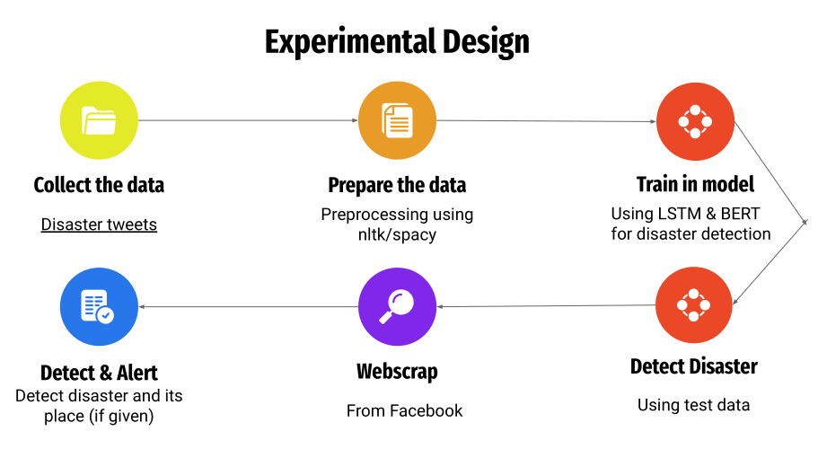

### Social Media Monitoring for Disaster Alert and Location Detection
## Developed a system to monitor social media posts to detect and alert the occurrence of any natural disaster.
## Used BERT & LSTM for decision-making and spaCy to extract the location.

## Overview
This project aims to monitor social media platforms to detect disaster-related content in real-time. By analyzing social media posts, the system identifies potential disaster events and attempts to detect the location of such events, providing timely alerts and actionable insights.

## Features
- **Real-time Disaster Monitoring:** Continuously analyzes social media feeds to detect potential disaster events.
- **Location Detection:** Identifies the geographic location associated with disaster-related content.
- **Alerts and Notifications:** Sends timely alerts when a disaster event is detected.
- **Data Visualization:** Provides visual insights and trends related to disaster events and locations.

## Installation
To set up the project locally, follow these steps:

1. **Clone the repository:**
   ```bash
   git clone https://github.com/Md-Rifat-Islam/Social-Media-Monitoring-for-Disaster-Alert-and-Location-Detection.git
2. Navigate to the project directory:
   ```bash
   cd Social-Media-Monitoring-for-Disaster-Alert-and-Location-Detection
3. Install dependencies:
   Ensure you have Python and pip installed. Run:
   ```bash
   pip install -r requirements.txt
##Usage
Configure API Keys:
Set up any required API keys for social media platforms in an .env file.

##View Alerts:
Disaster alerts will be generated in real-time, and relevant information will be displayed in the console or saved to a log file.

##Project Structure
- data/: Contains datasets and resources.
- src/: Source code for data processing, monitoring, and alerting.
- notebooks/: Jupyter notebooks for exploratory data analysis (EDA).
- main.py: Entry point for running the monitoring service.

##Technologies Used
- Python: For data processing and backend services.
- Natural Language Processing (NLP): To analyze social media text content.
- Geolocation APIs: Not used.
- Social Media APIs: To collect real-time social media data.

